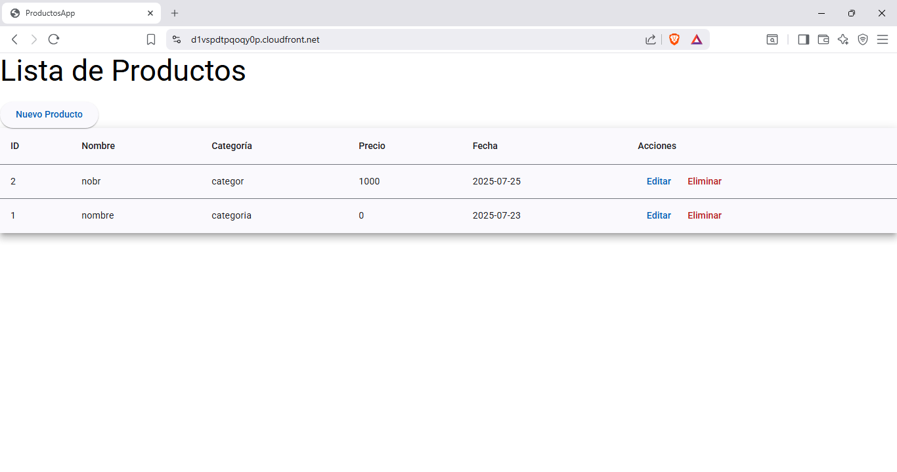
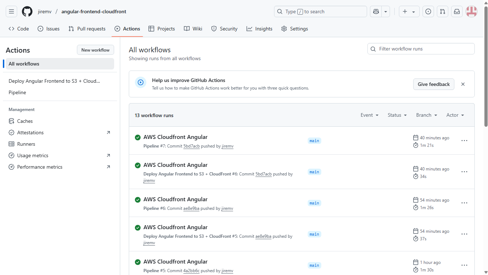

# 🔥  angular-frontend-cloudfront

Servicio AWS Cloudfront que despliega el frontend del proyecto java-backend-quarkus

https://d1vspdtpqoqy0p.cloudfront.net/index.html




## 📄 Descripción

Este proyecto renderiza la lectura del backend del proyecto **java-backend-quarkus** en la vista
para que el usuario pueda realizar el CRUD.
Se basa sobre **AWS Cloudfront** y está desplegado en **GitHub Actions**


## 📋 Consideraciones adicionales

- Este proyecto AWS puede ser montado para su empresa.
- El `template.yaml` crea automáticamente:
  - El cloudformation.
  - El llenado automático y actualización automática de los objetos a **AWS S3**.

- El proyecto es ideal para ahorrar costos y obtener alta rentabilidad, pues,
AWS Cloudfront es más económico que un servicio de hosting dedicado.

---
## 🛠️ Servicios AWS utilizados

- **Amazon S3**
  - Proporciona almacenamiento donde residen las fuentes de angular.

- **AWS CloudFormation**
  - Proporciona IaC.
  - Crea el Stack en los ambientes Dev y Prod.

- **Amazon Cloufront**
  - Permite desplegar a nivel del globo terráqueo.

- **AWS SAM (Serverless Application Model)**
  - Despliegue de la infraestructura como código (`template.yaml`).

---

## 🚀 Despliegue del proyecto

### 1️⃣ GitHub Actions
- Diríjase al link Actions, allí podrá visualizar el despliegue DevOps.
  

### 2️⃣ Clona el repositorio y navega al proyecto:
```bash
git clone https://github.com/tu-usuario/angular-frontend-cloudfront.git
cd angular-frontend-cloudfront
```

### 3️⃣ Despliegue:
```bash
sam build
sam deploy --guided
```

Durante el despliegue:
- Proporciona el nombre del stack.
- Define la región AWS.
- Acepta permisos de tipo `CAPABILITY_IAM`.

---

## 📜 Licencia

Este proyecto es de código abierto. Puedes adaptarlo y reutilizarlo bajo los términos de tu organización.

---

## 🧑 Contacto

**Paul Rivera**
- AWS Certified Solutions Architect - Associate
- AWS Certified Cloud Practitioner
- Oracle Java EE Master Developer
- Java2 Developer


